# turnbreak

[](https://github.com/Milkeles/turnbreak/actions/workflows/ci.yml)
[](LICENSE)

Shows you something worth reading while your coding agent works.



That's [`docs/demo.sh`](docs/demo.sh), which runs turnbreak end to end against a scratch folder. Run it yourself to see the full article body.

## Why

An agent turn on a real task runs one to five minutes. That's too short to switch to something else and too long to just wait. Turnbreak points that time at something you already meant to read.

It watches how long the current turn has been running. Past a threshold (90 seconds by default), it opens one browser tab and puts something in it. You read it while the agent works. When you click Read, or the turn ends, it gets out of the way.

The server binds to `127.0.0.1` only. Everything it shows you stays on disk. See [`SECURITY.md`](SECURITY.md) for the exact guarantee.

## Install

Turnbreak isn't on PyPI yet, so install it straight from this repository. You'll need `pipx` (`apt install pipx` on Debian and Ubuntu, `brew install pipx` on macOS).

```bash
pipx install "turnbreak @ git+https://github.com/Milkeles/turnbreak.git"
turnbreak install claude   # or codex, gemini, copilot
turnbreak mode folder ~/notes
```

Point `mode folder` at any directory of `.md` or `.txt` files: notes, saved articles, a docs folder. Start your agent and work as usual. A turn that runs past the threshold opens the reading tab with something from that folder.

Want curated content instead of a folder, or hit an install snag? See [Curated mode](#curated-mode) and [Alternative installation](#alternative-installation) below.

## Usage

| Command | What it does |
|---|---|
| `turnbreak install <claude\|codex\|gemini\|copilot>` | Register the turn-start/turn-stop hook for an agent |
| `turnbreak mode curated` / `turnbreak mode folder PATH` | Read from your interests, or from a folder of files instead |
| `turnbreak watch` | A terminal view of the same list, for working without the browser tab |
| `turnbreak serve --port 7717` | Start the server and open the tab by hand |

Read, Next, and Previous are the only actions. Read marks the item done and moves on. Next and Previous just browse, without marking anything read. Doing neither leaves the item on screen. That's the default, not a separate command.

### Curated mode

Curated mode pulls items from your stated interests instead of a folder: an article, an RSS entry, or a search result. Three finders decide how it finds candidates.

| Finder | Needs | Cost |
|---|---|---|
| `agent` | Your coding agent's CLI, run headless | Tokens, billed to you |
| `rss` | A feed list you supply | None |
| `search` | An API key | Per query |

Curated mode needs the `sources` extra for article extraction and feed parsing: `pipx install "turnbreak[sources] @ git+https://github.com/Milkeles/turnbreak.git"`.

```bash
turnbreak onboard          # write your interests, one per line
turnbreak finder rss       # or agent, or search
turnbreak mode curated
```

`turnbreak onboard` writes `~/.config/turnbreak/interests.md`. If you pick the `agent` finder, it also asks you to confirm it can spend tokens fetching candidates, since that finder shells out to your agent's CLI and bills you for it.

## Supported formats

- Markdown (`.md`) and plain text (`.txt`): rendered in the shell and counted directly.
- HTML (`.html`): stripped of markup and rendered. Word count uses `trafilatura` extraction. Needs the `sources` extra.
- PDF (`.pdf`): embedded into the page as base64 bytes, so the page, buttons, title, and favicon stay under turnbreak's control. `pypdf` extracts text for a read-time estimate. If extraction fails, the PDF still shows, just without an estimate.

Not supported yet: EPUB. Browsers have no native EPUB renderer, and turnbreak doesn't ship one in v0.1.0.

## Supported agents

`turnbreak install` covers Claude Code, Codex, Gemini CLI, and Copilot CLI. Claude Code and Copilot CLI are what the maintainer runs day to day, so those two are tested against a real account. Codex and Gemini CLI support is built against their documented hook formats but not exercised the same way. Please report anything that breaks on either.

## Configuration

`~/.config/turnbreak/config.toml`, written on first run:

| Setting | Default | What it does |
|---|---|---|
| `threshold_seconds` | `90` | How long a turn runs before the tab gets an item |
| `port` | `7717` | The loopback port the server binds to |
| `words_per_minute` | `230` | Used to estimate read time, never to guess it |
| `target_read_minutes` | `2, 4` | The reading-time range turnbreak prefers when picking the next item |

## How it works

[`docs/architecture.md`](docs/architecture.md) covers the timer, the server, the two sources, and the adapter boundary in full. In short: a detached watcher process measures real elapsed time per turn, never a prediction, and pushes to a page over Server-Sent Events so the tab updates without a refresh.

## Alternative installation

<details>
<summary>No <code>pipx</code>, a PEP 668 error, or you'd rather use a venv</summary>

Recent Debian and Ubuntu block a plain `pip install` outside a virtual environment with an `externally-managed-environment` error. Use a venv instead of `pipx`:

```bash
python3 -m venv .venv && source .venv/bin/activate
pip install "turnbreak @ git+https://github.com/Milkeles/turnbreak.git"
```

Add `[sources]` if you want curated mode or HTML/PDF support: `pip install "turnbreak[sources] @ git+https://github.com/Milkeles/turnbreak.git"`.
</details>

## Development

```bash
uv sync --extra dev --extra sources
uv run pre-commit install
```

`pre-commit install` wires the hooks in `.pre-commit-config.yaml` into `.git/hooks/pre-commit`, so `ruff check`, `ruff format --check`, and `mypy` all run before a commit lands. Run every hook by hand with `uv run pre-commit run --all-files`. CI runs the same hooks again on every push and pull request, so a clean commit here means a clean CI run too.

See [`AGENTS.md`](AGENTS.md) for the rest of the dev commands: running a single test, linting, type checking, building.

## Contributing

See [`CONTRIBUTING.md`](CONTRIBUTING.md). Found a security issue instead? See [`SECURITY.md`](SECURITY.md).

## License

MIT. See [`LICENSE`](LICENSE).
